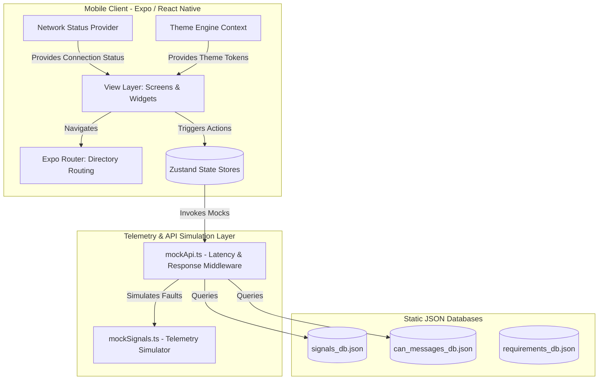

# VOLT Mobility — L5 EV Telematics & Operations Platform
> **Enterprise-grade multi-tenant connected vehicle mobile client for fleet management, remote immobilization, and predictive diagnostics.**

[](https://docs.expo.dev/)
[](https://reactnative.dev/)
[](https://github.com/pmndrs/zustand)
[](https://www.typescriptlang.org/)
[](https://github.com)
[](https://github.com)

---

## 1. Hero Section

VOLT Mobility is a high-performance, multi-tenant mobile platform built on Expo SDK 56. It provides a real-time interface for managing L5-category electric vehicles (EVs) by bridging hardware-level CAN bus telematics with role-specific dashboards. 

The application is tailored for four distinct operational roles:
* **End Customers**: Monitor vehicle diagnostics, SOC trends, charging sessions, and trigger remote alarms.
* **Dealers**: Track service queues, manage complaints, and log technicians' repair work.
* **Financiers**: Monitor portfolio loan defaults (vehicle inactivity tracking) and request remote assets immobilization.
* **VOLT OEM Admins**: Review system-wide faults, authorize immobilization requests, and trigger OTA updates.

---

## 2. Table of Contents
1. [Features](#3-features)
2. [Screenshots & Demo](#4-screenshots--demo)
3. [Architecture Overview](#5-architecture-overview)
4. [Tech Stack](#6-tech-stack)
5. [Project Structure](#7-project-structure)
6. [Installation](#8-installation)
7. [Configuration](#9-configuration)
8. [Usage](#10-usage)
9. [API Documentation](#11-api-documentation)
10. [Database](#12-database)
11. [Security](#13-security)
12. [Performance](#14-performance)
13. [Testing](#15-testing)
14. [Development Workflow](#16-development-workflow)
15. [Deployment](#17-deployment)
16. [Roadmap](#18-roadmap)
17. [Contributing](#19-contributing)
18. [FAQ](#20-faq)
19. [Troubleshooting](#21-troubleshooting)
20. [License](#22-license)
21. [Acknowledgements](#23-acknowledgements)
22. [Contact](#24-contact)

---

## 3. Features

### Core Capabilities
* **Role-Based Navigation Guards**: Automatically verifies sessions and restricts routing to authorized layouts (`(customer)`, `(dealer)`, `(financier)`, or `(oem)`).
* **SOCArcGauge**: A custom SVG arc path driven by React Native Reanimated that updates fluidly as the vehicle's state of charge changes.
* **Step-Up Verification Modal**: Prompts users for a secondary OTP challenge prior to executing sensitive commands (e.g., vehicle locator pings).
* **Command Status Lifecycle**: Animates command progress states (`QUEUED` $\to$ `SENT` $\to$ `ACKNOWLEDGED`) on the UI thread.
* **Immobilization Workflow**: Integrates multi-step approval gates between Financiers and OEM operators.
* **Offline Banner Hook**: A network state listener that displays a warning banner across all layouts if the network connection drops.

### Developer Features
* **Telemetry Data Simulator**: Simulates vehicle data updates at 5-second intervals.
* **Diagnostics Specifications Explorer**: Searchable database querying 7 static JSON databases containing parsed CAN and signal requirements.
* **Dynamic Theme Context**: Restyles layouts dynamically between dark and light modes.
* **i18n Translation Engine**: Seamlessly toggles layouts between English and Hindi translations.

---

## 4. Screenshots / Demo

### Operational Previews

| End-Customer Dashboard | Specifications Search | Multi-Step Authorization |
|:---:|:---:|:---:|
|  <br> *Dynamic SOC & Telemetry View* |  <br> *Real-time CAN registers browser* |  <br> *Step-up remote command gate* |

> [!NOTE]
> Demo images shown above are illustrative. Real devices will render high-res dark mode templates automatically based on device settings.

---

## 5. Architecture Overview

The system architecture organizes components into distinct layers to separate UI elements, state management, and the mock data services:



---

## 6. Tech Stack

| Technology | Purpose | Version |
| :--- | :--- | :--- |
| **Expo** | Application runtime | `~56.0.12` |
| **React Native** | Native compilation shell | `0.85.3` |
| **Zustand** | State management store | `^5.0.14` |
| **React Native Reanimated** | UI thread animation execution | `4.3.1` |
| **React Native SVG** | Dynamic vector gauge paths | `15.15.4` |
| **Gifted Charts** | Telemetry diagnostic graphs | `^1.4.77` |
| **TypeScript** | Type-safe development | `~6.0.3` |

---

## 7. Project Structure

```
src/
├── app/         # Routing routes (auth, customer, dealer, financier, oem)
├── components/  # Reusable widgets and dynamic layouts
├── constants/   # JSON databases, style variables, and navigation routes
├── hooks/       # Screen behaviors
├── providers/   # Global providers (theme settings and network banners)
├── services/    # Mock APIs, telemetry, and trip summaries
├── store/       # Zustand stores (sessions, vehicle logs, alerts)
├── theme/       # Light & dark mode theme tokens
├── i18n/        # Translation files (English and Hindi)
└── types/       # TypeScript type declarations
```

---

## 8. Installation

Ensure you have [Node.js](https://nodejs.org/) (v18+) and npm installed on your development machine.

### 1. Clone the repository
```bash
git clone https://github.com/your-org/volt-mobility.git
cd volt-mobility
```

### 2. Install dependencies
```bash
npm install
```

### 3. Start development server
```bash
npm start
```

Press:
* `i` to launch the **iOS Simulator** (requires Xcode).
* `a` to launch the **Android Emulator** (requires Android Studio).
* `w` to launch the **Web Browser** target.
* Alternatively, scan the QR code displayed in the terminal using the **Expo Go** app on a physical device.

---

## 9. Configuration

This prototype operates entirely client-side using mock databases and does not require external backend connections.

### Local Variables & Flags
Configuration flags are defined at the top of `src/services/mockApi.ts`:
* **`simulateFault`**: Set to `true` to force mock API endpoints to throw errors, simulating network timeouts and service outages.
* **`findVehiclePingsToday`**: Tracks mock rate limits for remote command executions.

---

## 10. Usage

### Role-Based Login Credentials
Login using any of the following phone numbers with the mock OTP code **`1234`**:

| Role | Phone Number | Accessible Features |
| :--- | :--- | :--- |
| **End Customer** | `9876543210` | Main telemetry dashboard, battery analytics, trips history, and service scheduler. |
| **Dealer** | `9988776655` | Dealer fleet logs, maintenance lists, and service ticket creators. |
| **Financier** | `9111222333` | Portfolio risk alerts and vehicle immobilization request forms. |
| **VOLT OEM Admin** | `9000000001` | System-wide alerts, immobilization approval list, and OTA updates manager. |

> [!TIP]
> **Demo Mode**: Enter any unregistered phone number and verify with `1234` to launch the **Role Selection** screen, letting you test different roles on the fly.

---

## 11. API Documentation

Remote services are simulated inside `src/services/mockApi.ts`.

### Key Mock Endpoints

#### 1. Fetch Vehicle Status
```typescript
export async function getVehicleStatus(vin: string): Promise<VehicleStatus>
```
* **Latency**: 300–900ms.
* **Throws**: Exception if `simulateFault` is enabled.
* **Response**: Returns vehicle metadata (e.g., `model`, `variant`) and live signal parameters (e.g., `soc`, `odometer`, `cellImbalance`).

#### 2. Send Remote Command
```typescript
export async function sendRemoteCommand(command: CommandType, vin: string, token: string): Promise<CommandResult>
```
* **Lifecycle**: Transitions status from `QUEUED` $\to$ `SENT` $\to$ `ACKNOWLEDGED`.
* **Rate Limits**: Limited to 3 daily locator pings per vehicle.

---

## 12. Database

The application uses local JSON databases compiled from telemetry configurations and vehicle requirements.

* **`signals_db.json`**: Mappings for diagnostic telemetry, including ECU source addresses, CAN IDs, data types, and minimum/maximum values.
* **`can_messages_db.json`**: Mappings for CAN frames, cycle times, and data length codes (DLC).
* **`requirements_db.json`**: Mappings for product requirements, priorities, and acceptance criteria.

---

## 13. Security

### Implemented Protocols
* **Step-Up Verification**: Sensitive actions (e.g., remote engine lock) require OTP validation before execution.
* **Navigation Guards**: Layout guards verify user roles on transition, preventing unauthorized access.
* **DPDP Compliance Toggles**: Setting switches let customers disable location tracking and log sharing.

---

## 14. Performance

* **Native Animation Rendering**: Telemetry gauge paths and list transitions are run on the device's native UI thread via React Native Reanimated.
* **Zustand Selectors**: Components subscribe to specific store properties to prevent unnecessary re-renders.

---

## 15. Testing

### 1. Compile Checks
Verify that the codebase compiles successfully without type errors:
```bash
npm run typecheck
```

### 2. Linting & Health Checks
Verify Expo configuration rules and dependencies:
```bash
npm run doctor
```

---

## 16. Development Workflow

### Git Flow & Commit Rules
* **Branch Conventions**: Make changes on feature branches (e.g., `feature/auth-biometrics`, `bugfix/gauge-stutter`).
* **Commit Messages**: Follow conventional commits (e.g., `feat: add OTP step-up verification`, `fix: correct gauge path overflow`).

---

## 17. Deployment

Deploy the application using [Expo Application Services (EAS)](https://expo.dev/eas):

### 1. Install EAS CLI
```bash
npm install -g eas-cli
```

### 2. Log in to Expo
```bash
eas login
```

### 3. Build Binaries
```bash
eas build --platform all
```

---

## 18. Roadmap

- [x] **Role-Based Layouts**: Support for Customer, Dealer, Financier, and OEM admin roles.
- [x] **Dynamic Theme System**: Dynamic dark and light theme context with persistence.
- [x] **Animated SVG Gauges**: Reanimated gauges for live telemetry.
- [ ] **Native Biometrics**: Integrate face and fingerprint recognition.
- [ ] **Time-Series Offline Sync**: Cache telemetry locally when offline and sync to SQLite database when online.
- [ ] **GraphQL Subscriptions**: Stream telemetry in real-time via WebSockets.

---

## 19. Contributing

1. **Fork** the repository and create your feature branch: `git checkout -b feature/my-feature`.
2. **Commit** your changes following conventional commit guidelines.
3. Verify that compilation checks pass: `npm run typecheck`.
4. Open a **Pull Request** detailing your changes and their impact.

---

## 20. FAQ

#### Q: How do I resolve login errors during local development?
A: Ensure you are logging in with one of the pre-configured numbers (e.g., `9876543210`) and using the OTP code `1234`.

#### Q: Why is my remote command failing to execute?
A: Verify that the `simulateFault` flag is set to `false` in `src/services/mockApi.ts`.

---

## 21. Troubleshooting

#### Error: `Unknown event handler property` warning on Web
* **Reason**: Caused by older version compatibility issues between React 19 and React Native Web.
* **Solution**: These warnings are suppressed automatically during initialization in `src/app/_layout.tsx`.

#### Metro bundler fails to compile
* **Solution**: Clear the bundler cache and restart the development server:
  ```bash
  npm run reset
  ```

---

## 22. License

Proprietary — Registered for internal use only by **VOLT Mobility**. Unauthorized copying, distribution, or modifications are strictly prohibited.

---

## 23. Acknowledgements

* **Expo Router Team**: For providing directory-based routing navigation.
* **Lucide Icon Library**: For supplying clean, theme-aware icons.

---