# System Flowcharts & Architecture Documentation
*VOLT Mobility L5 EV Mobile Platform - Technical Architecture Reference Manual*

---

## 1. High-Level System Architecture

This diagram illustrates the high-level boundaries of the VOLT Mobility mobile client, its state management stores, the mock API middleware, and local JSON databases, representing the prototype environment.

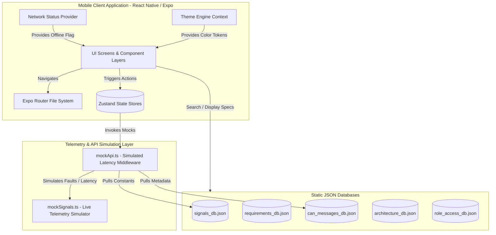

### Explanation
The client is structured as an offline-first hybrid shell built using Expo Router. State management is delegated to Zustand stores (`authStore`, `vehicleStore`, `alertStore`). In place of a live HTTP backend, network interactions route through `mockApi.ts`, which injects 300–900ms latency to simulate internet round-trip delays, pulling metadata and baseline values from local JSON databases representing the parsed CAN telemetry sheets.

- **Potential Failure Points**: Mock API fault injection (`simulateFault` toggle) simulates endpoint timeout states, handled by local screen error banners.
- **Security Considerations**: Authentication is simulated locally. Real deployment will require replacing local memory stores with Keychain/Keystore drivers.

---

## 2. Repository Architecture

The folder structure organizes files by feature and system layer, keeping application routing separated from logic and styling tokens.

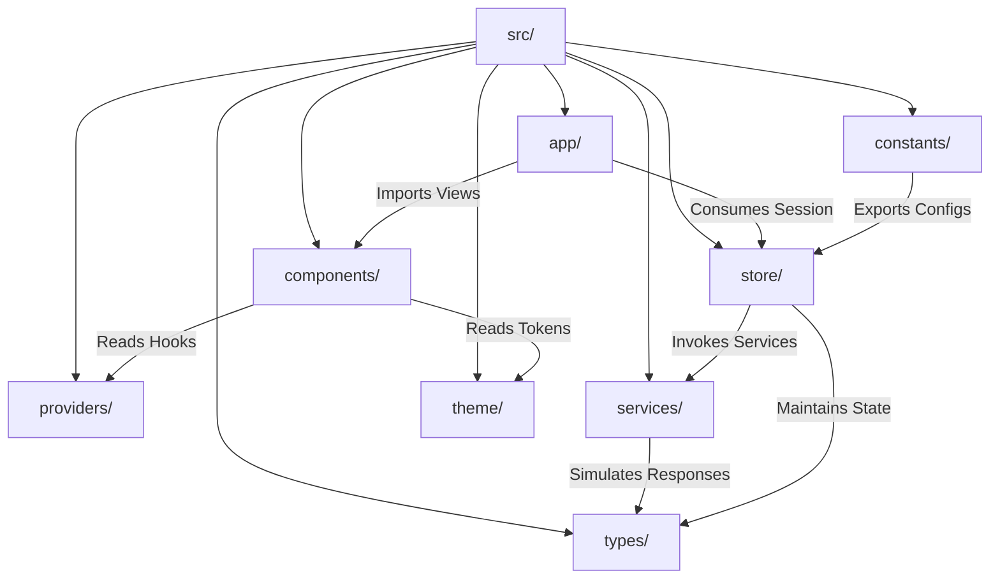

### Explanation
- **app/**: Configures directory-based routing files. Route-guard layouts authenticate users and segment routing contexts by role (`(customer)`, `(dealer)`, `(financier)`, `(oem)`).
- **components/**: Houses layout shells, charts, and reusable UI primitives.
- **store/**: Governs application state and handles async data processing.
- **services/**: Orchestrates mock endpoints and latency delays.
- **constants/**: Defines navigation metrics, role logins, and parses compile-time databases.

---

## 3. Request Lifecycle

The diagram shows the lifecycle of a user interaction (e.g., executing a remote command) from the UI layer to execution verification.

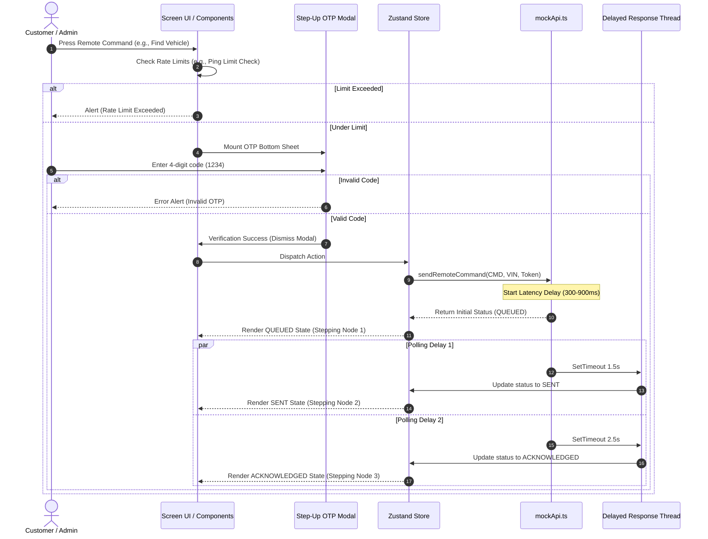

### Explanation
When a remote command is triggered, the UI verifies rate limits. The user is prompted with an OTP step-up verification modal. Once verified, an async dispatcher calls the store, firing the simulated endpoint in `mockApi.ts`. The response completes via a set of cascading status updates (Queued $\to$ Sent $\to$ Acknowledged) simulating command delivery.

- **Potential Failure Points**: Script crashes if the OTP refs are out of sync or if state changes interrupt timer loops.
- **Performance considerations**: Uses React Native Reanimated animations for node transitions to prevent blocking the main JS thread during API loads.

---

## 4. Authentication Flow

This diagram illustrates the login workflow, device verification check, and role select logic used to determine route destinations.

```mermaid
flowchart TD
    Start[User Opens App] --> Guard{Session Persisted?}
    Guard -->|Yes| DevCheck{Device Verified?}
    Guard -->|No| Login[login.tsx - OTP Login Screen]

    Login -->|Input Phone & Send| OTPSent[60s Timer Starts & OTP Sent]
    OTPSent -->|Enter 1234| OTPCheck{OTP Valid?}
    OTPCheck -->|No| OTPError[Show Invalid OTP Alert] --> OTPSent
    OTPCheck -->|Yes| MatchUser{Phone in MOCK_USERS?}

    MatchUser -->|Yes| LoginStore[authStore: Set authenticated user session]
    MatchUser -->|No| RoleSelect[role-select.tsx - Select Role manually]
    RoleSelect -->|Select Role| LoginStore

    LoginStore --> DevCheck
    DevCheck -->|Yes| RouteDest{Role Route Select}
    DevCheck -->|No| DevVerify[device-verify.tsx - Fingerprint verification]
    DevVerify -->|Press Verify Device| RouteDest

    RouteDest -->|CUSTOMER| CustDash[/(customer) tab stack]
    RouteDest -->|DEALER| DealDash[/(dealer) stack]
    RouteDest -->|FINANCIER| FinDash[/(financier) stack]
    RouteDest -->|VOLT| OemDash[/(oem) stack]
```

### Explanation
Authentication uses a simulated SMS OTP gateway. After entering a valid phone number, the app verifies if it matches a pre-configured profile. If the number is unregistered, a role selector page is shown to let developers test other roles. Customers are filtered through a device fingerprint check (`device-verify.tsx`) before navigating to their layout stack.

- **Files Involved**: `login.tsx`, `role-select.tsx`, `device-verify.tsx`, `authStore.ts`.
- **Security Considerations**: Device fingerprint uses a hardcoded hash token representation `VOLT-DEV-A1B2C3D4` which must be replaced with a dynamic hardware key exchange during integration.

---

## 5. API Flow

This flowchart shows the pipeline of an API invocation inside the React Native frontend layer.

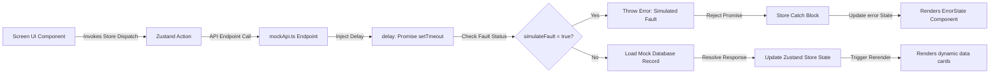

### Explanation
- **Files Involved**: `src/services/mockApi.ts`, state stores (`store/*.ts`), screen views.
- **Entry Point**: A screen component fires a store dispatch.
- **Exit Point**: Renders either a dynamic data display or the `<ErrorState>` retry component.
- **Performance considerations**: The random delay (300-900ms) matches realistic network latency, allowing developers to inspect load states.

---

## 6. Database Flow

The system uses locally stored JSON files as structured telemetry databases, mimicking tables in a relational database.

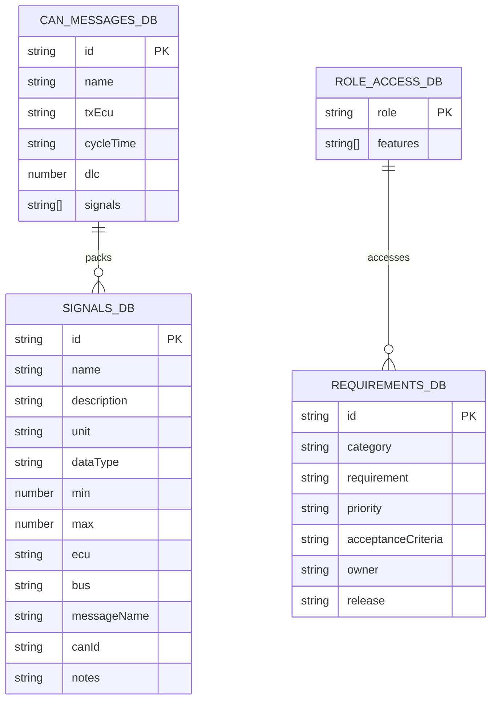

### Explanation
The database schema maps relationships between CAN messages and telemetry signals. The JSON records are compiled during build-time from CSV sheets.
- **Queries**: Queried dynamically in `specifications.tsx` using native JS `.filter()` searches.

---

## 7. Component Interaction Diagram

This diagram maps how user interaction bubbles up through custom inputs, dynamic providers, state containers, and visual widgets.

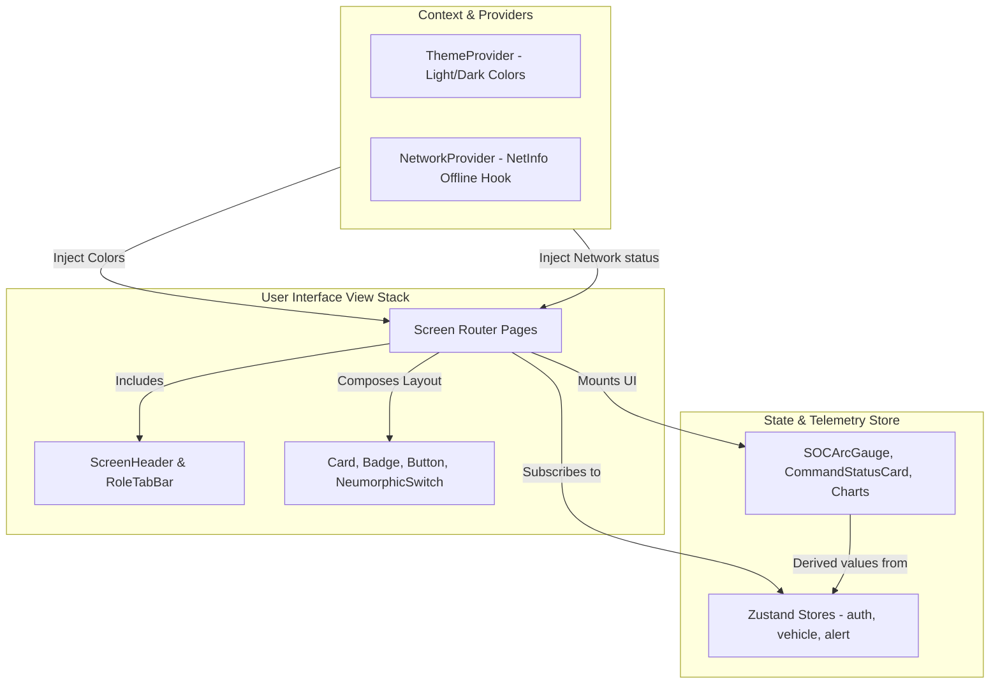

### Explanation
Components read theme values from `ThemeProvider` and network changes from `NetworkProvider`. Data-centric components like `SOCArcGauge` and `CommandStatusCard` subscribe directly to Zustand state updates, re-rendering whenever signal values are recalculated.

---

## 8. State Management Flow

This flowchart traces a Zustand state update loop, starting from user action to persistent local storage write.

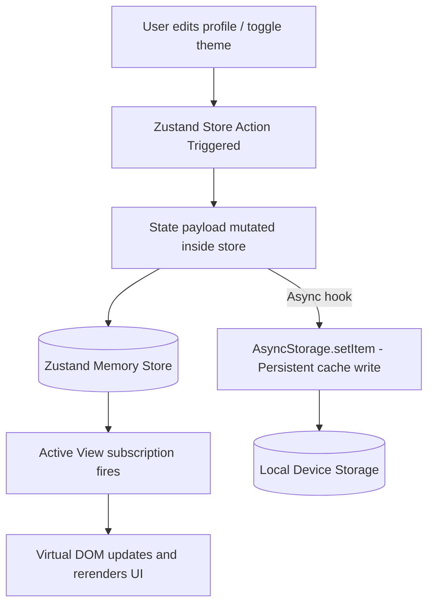

### Explanation
- **Libraries**: Zustand v5.
- **Persistence**: Store changes like theme preference are written to native `AsyncStorage` and reloaded on app startup.

---

## 9. Background Processes

This diagram represents scheduled tasks and listener loops executing in the background.

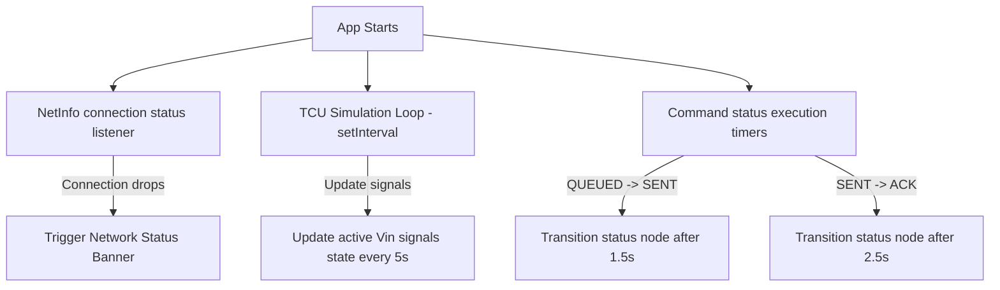

### Explanation
Three background processes execute concurrently:
1. Network status checker listeners.
2. Simulated telemetry status loops updating signal data.
3. CommandStatus trackers simulating status delays for remote commands.

---

## 10. External Service Integration

This diagram maps integrations with native device features and external app wrappers.

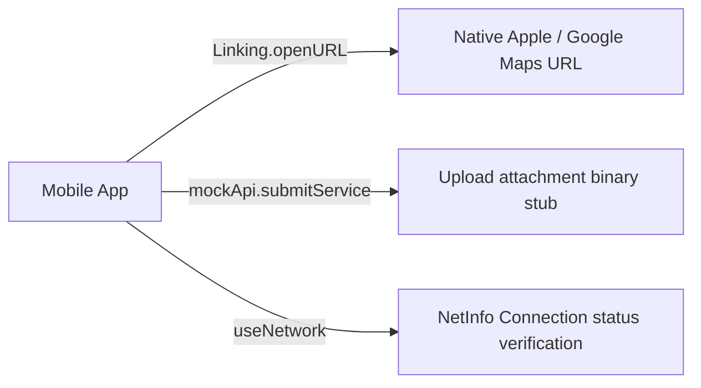

### Explanation
- **Maps**: Uses native deep linking (`geo:latitude,longitude` or `maps://?q=`) to launch map navigation.
- **Payments & Analytics**: Marked out-of-scope for the frontend prototype.

---

## 11. Error Handling Flow

This flowchart traces exception propagation from simulated failure triggers to UI banners.

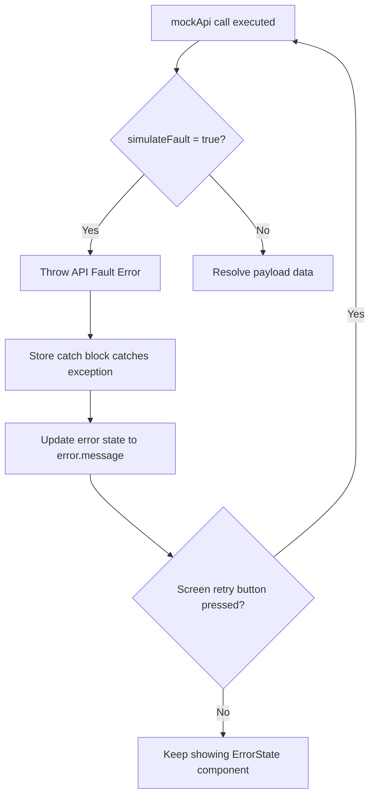

### Explanation
If `simulateFault` is toggled, API calls reject immediately. The catcher sets the error state, prompting the screen to hide data and mount a styled retry banner.

---

## 12. Deployment Architecture

This diagram shows the local testing and production distribution architecture using Expo Application Services (EAS).

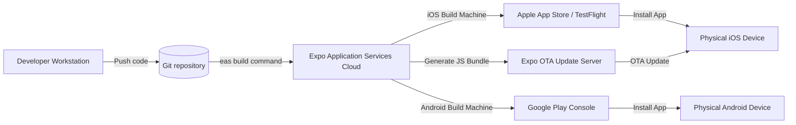

### Explanation
The app deploys using EAS Build containers. The source code is uploaded to Expo Cloud build servers, compiling static packages for iOS App Store and Google Play Console distribution.

---

## 13. CI/CD Pipeline

This diagram shows the verification and deployment pipeline.

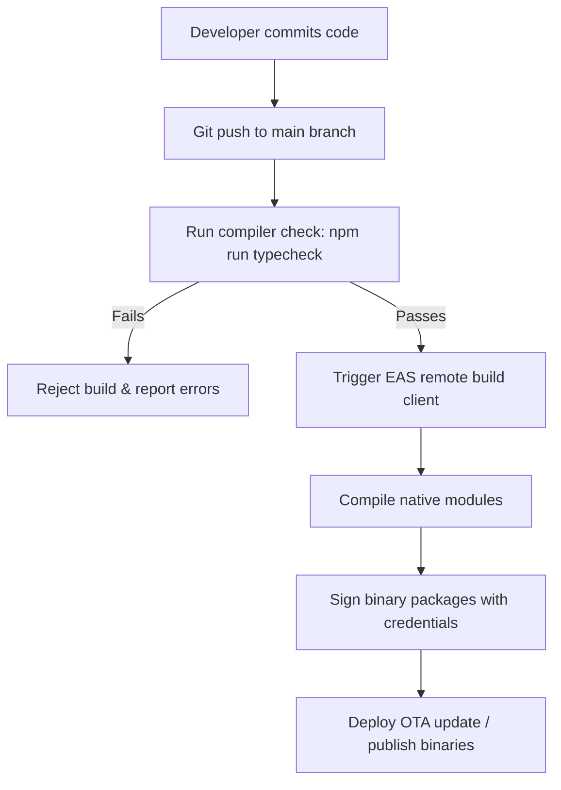

### Explanation
The CI pipeline runs compilation checks (`tsc --noEmit`). On success, the EAS compiler packages static bundles for distribution.

---

## 14. Security Flow

The system flows matching user authorization levels and privacy protocols.

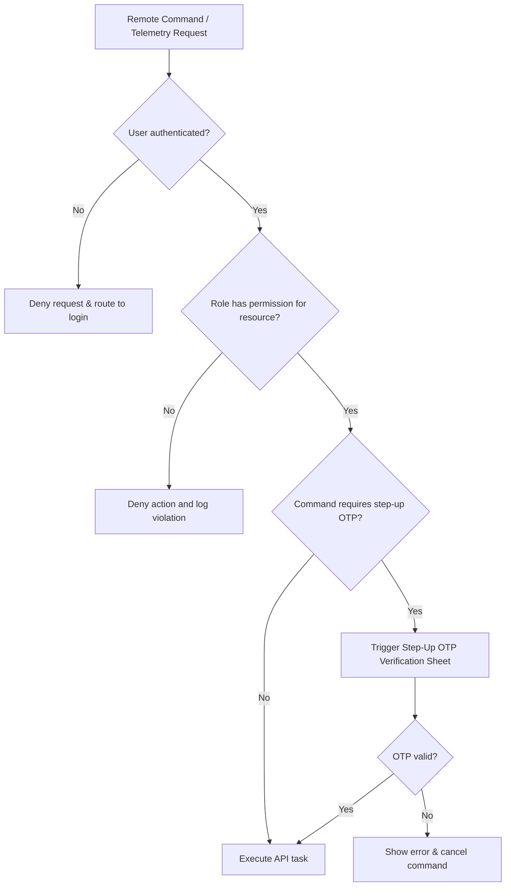

### Explanation
The security architecture enforces:
1. Authenticated session validation.
2. Role access filters (e.g., Financiers cannot view service creation forms).
3. Step-up OTP challenges for remote actions.

---

## 15. Data Flow Diagram

The telemetry flow from raw signal mapping to gauge rendering.

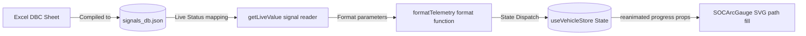

### Explanation
CAN signals are extracted at build time, filtered dynamically, and formatted into human-readable strings before driving the virtual SVG gauge paths.

---

## 16. Sequence Diagrams

### E2E Remote Command Lifecycle (Find Vehicle)

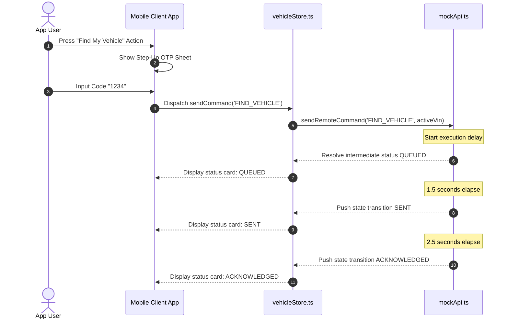

---

## 17. Dependency Graph

This diagram shows the module import hierarchy across major codebase libraries.

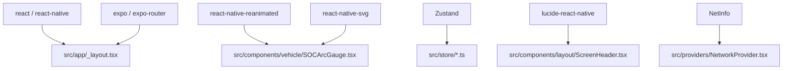

### Explanation
- **Internal Libraries**: Custom UI components are imported by routing entry points.
- **External Libraries**: Standard React Native, Reanimated, and Svg utilities form the runtime environment.

---

## 18. Class Diagram (Interfaces)

This class diagram represents the core TypeScript interfaces governing the telematics schemas.

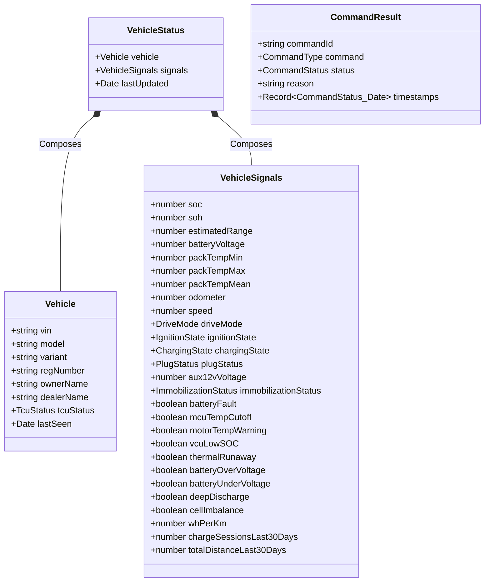

### Explanation
These typing files (`src/types/vehicle.ts`) establish compilation constraints, ensuring that simulated payloads conform strictly to runtime structures.

---

## 19. Execution Flow (Application Startup)

The startup and screen mount process.

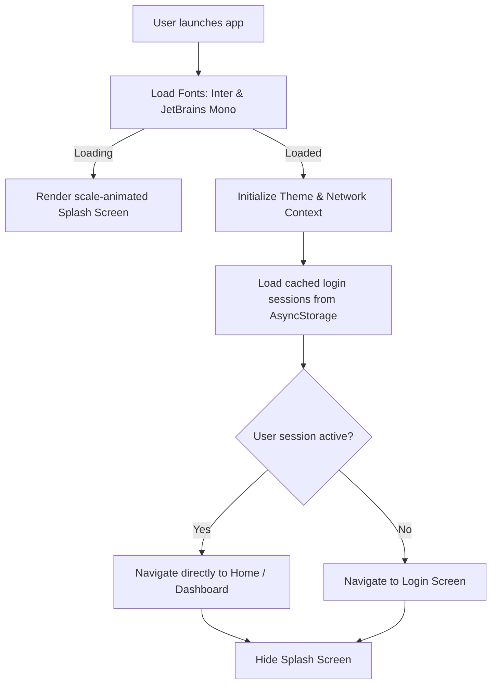

### Explanation
- **Entry File**: `src/app/_layout.tsx`.
- **Exit File**: Mounts the routing layouts based on authenticated sessions.

---

## 20. End-to-End User Journey

A complete view of a user's flow through the platform.

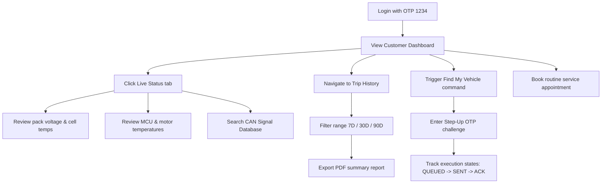

### Explanation
The customer logs in, reviews live stats, inspects raw CAN signals, filters analytics reports, and triggers remote command sequences. All actions are isolated by user context and role configurations.
