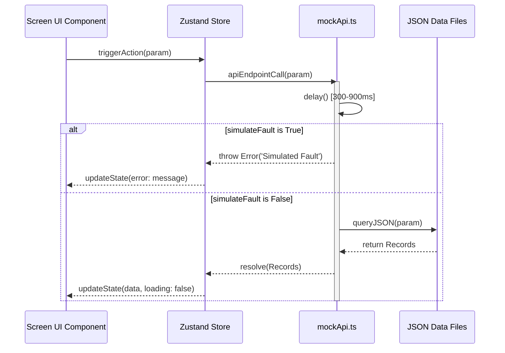
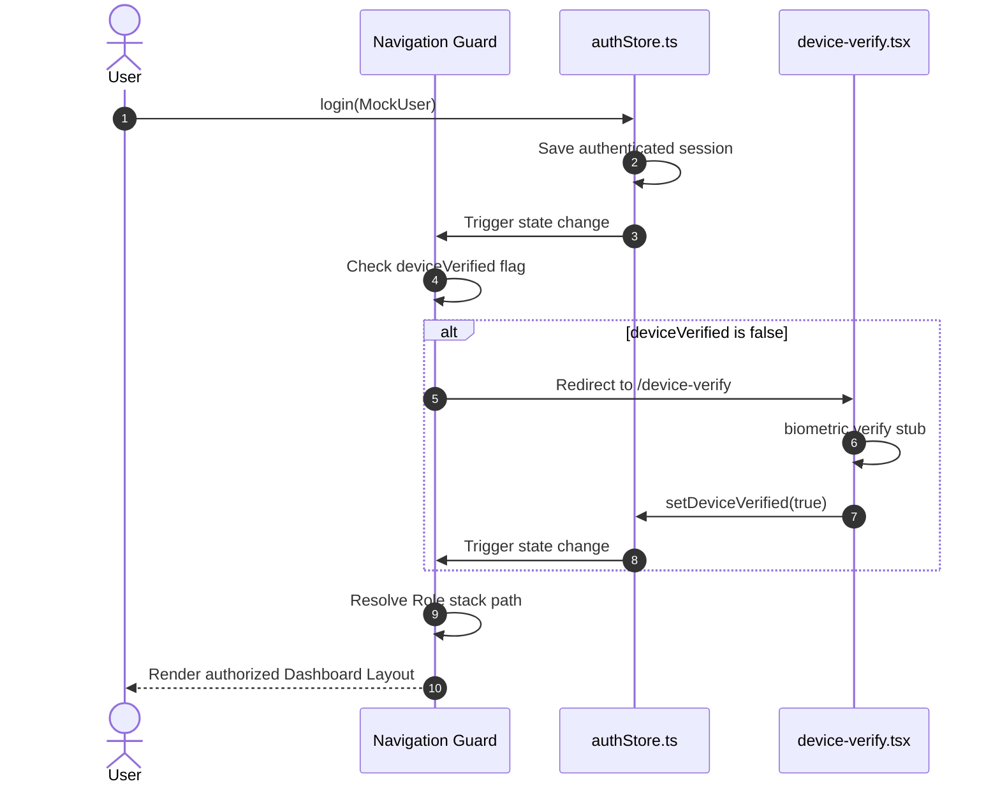

# Software Project Engineering Report
**VOLT Mobility L5 EV Fleet and Operations Telematics Platform**

---

## 1. Executive Summary

### Project Overview
The VOLT Mobility L5 EV Fleet and Operations Platform is a multi-tenant, role-based React Native mobile application built on top of the Expo v56 framework. The platform provides a robust user experience for managing modern electric vehicles (EVs) by bridging low-level Controller Area Network (CAN) bus signals with high-level user interface elements. It provides tailored experiences for four key personas: End Customers, Dealers, Financiers, and VOLT Operations (OEM admins).

### Business Objective
The primary business objective is to maximize operational efficiency, optimize battery life cycle management, reduce vehicle finance defaults, and streamline routine service turnarounds. By surfacing real-time telematics directly to stakeholders, VOLT Mobility aims to lower the Total Cost of Ownership (TCO) for EV fleets and reduce vehicle recovery times.

### Problem Statement
Modern EV fleet operations are plagued by fragmented information streams:
1. **End Customers** lack real-time visibility into State of Charge (SOC), live cell thermal profiles, and charging efficiency history.
2. **Dealers** manage maintenance appointments and vehicle diagnostic history via decoupled desktop software.
3. **Financiers** suffer high repossession costs due to lack of asset location visibility and inability to enforce payment deadlines.
4. **OEM Admins** struggle with manual over-the-air (OTA) updates and complex review processes for critical safety immobilizations.

### Target Users
- **End Customers (Drivers/Fleet Owners)**: Monitor vehicle telemetry (SOC, range, speed, battery health), track trip histories, handle OTA updates, and trigger remote locator alarms.
- **Dealers (Technicians/Service Managers)**: Track incoming service logs, review active fault codes, manage service appointments, and generate repair cards.
- **Financiers (Asset Managers/Underwriters)**: Monitor location telemetry for financed vehicles, evaluate default risk (inactivity periods), and request remote vehicle immobilization.
- **VOLT Operations (OEM Admins)**: Approve immobilization requests, review system-wide critical alerts, and trigger OTA software updates.

### Key Capabilities
- **Multi-Tenant Role Routing**: Automatic route guards redirecting logins to customized screens according to role classification.
- **Dynamic SVGArc Gauge**: Custom SVG path indicator driven by React Native Reanimated, showing live SOC.
- **Telemetry Specifications Explorer**: Searchable interface querying 7 static JSON databases containing parsed DBC configurations and vehicle requirements.
- **Step-Up Verification**: Multi-layered OTP sheets validating actions prior to remote command execution.
- **Automated Command Lifecycles**: Visual animation transitions tracking status changes (`QUEUED` $\to$ `SENT` $\to$ `ACKNOWLEDGED`).
- **Offline Reliability Hook**: Intercepts local system states and shows global warning banners if network connections drop.

### Technology Highlights
- **Framework**: Expo SDK 56 & React Native 0.85
- **State Management**: Zustand v5
- **UI & Graphics**: React Native SVG, Reanimated v4, Lucide React Native, React Native Gifted Charts
- **Formatting**: JetBrains Mono for telemetry readouts, Inter for operational headers
- **Type Safety**: TypeScript strict mode (`noImplicitAny: true`)

---

## 2. Project Overview

### Purpose
The project serves as an operational dashboard that handles telematics, remote execution protocols, and service ticketing. It compiles raw CAN database registers into readable diagnostic charts, enabling field technicians, financiers, and operations teams to interact with connected vehicles safely.

### Scope
- **Interactive Dashboards**: Role-specific dashboards displaying relevant telemetry.
- **Asset Control Routing**: Multi-step approvals for remote immobilization.
- **Remote Telematics**: Telemetry simulation showing live variables (MCU cutoffs, temperature indicators).
- **Service & Helpdesk**: Appointment managers, ticket creators, and service card builders.

### Limitations
- **Mock Service Architecture**: The app relies on `mockApi.ts` to simulate database records and delay pipelines.
- **No Native Biometrics**: Biometric loops are simulated through device-verify pages.
- **Static DBC Compiler**: CAN signal structures are bundled locally as static JSON rather than fetched from an active OTA broker.

### Assumptions
- **Persistent Local Cache**: The device retains configuration flags and session records across restarts via memory store layers.
- **TCU Connection**: The Telematics Control Unit (TCU) on the vehicle publishes JSON payloads containing battery and motor temperatures at 5-second intervals.
- **Network Handshake**: The mobile device has periodic internet access to resolve state transitions.

### Goals
- Resolve navigation overlaps between customer and administrative interfaces.
- Ensure type safety across the telemetry state models.
- Standardize layout headers and theme contexts.

### Success Criteria
- **Zero Typecheck Errors**: Compile type checks (`npm run typecheck`) without any warning outputs.
- **Aesthetic Premium Feel**: Use dark mode glassmorphism gradients and custom SVGs.
- **Simulated Latency handling**: Maintain skeleton loaders during data fetch operations.

---

## 3. System Architecture

### Overall Architecture
The platform is designed around a decoupled, client-driven Model-View-ViewModel (MVVM) architecture optimized for React Native. State containers coordinate queries with simulated service modules and update view templates dynamically.

```
+--------------------------------------------------------+
|                      VIEW LAYER                        |
|   (customer), (dealer), (financier), (oem) Screens    |
|   ScreenHeader / OfflineBanner / Custom SVG Gauges     |
+---------------------------+----------------------------+
                            | Subscribes to / Dispatches
                            v
+--------------------------------------------------------+
|                    CONTROLLER LAYER                    |
|       Zustand Stores (authStore, vehicleStore)        |
+---------------------------+----------------------------+
                            | Calls
                            v
+--------------------------------------------------------+
|                    SERVICE LAYER                       |
|   mockApi.ts (Latency / simulateFault / OTP Gates)     |
+---------------------------+----------------------------+
                            | Loads
                            v
+--------------------------------------------------------+
|                    DATA/DATABASE LAYER                 |
|   static JSON DBs (signals_db.json, requirements_db)   |
+--------------------------------------------------------+
```

### Client-Server Communication
Client-server interactions are simulated by `mockApi.ts`. When a call is fired, a middleware pipeline:
1. Injects a randomized delay (300–900ms) using `setTimeout`.
2. Inspects `simulateFault` state flags. If active, it returns a rejected promise.
3. Retrieves data from local JSON databases, returning structured responses.



### Request Lifecycle
Every remote interaction executes through a standardized sequence:
1. **Event Dispatch**: User triggers an event (e.g., locking a vehicle).
2. **Rate Limit Validation**: The app evaluates constraints (e.g., maximum of 3 locator pings daily).
3. **Step-Up Verification**: Displays an OTP card to authorize the command.
4. **Latency Simulation**: Displays loading skeletons during the mock delay.
5. **State Transition**: State updates from `QUEUED` $\to$ `SENT` $\to$ `ACKNOWLEDGED`.
6. **Persistence**: Writes states to the local memory layer.

---

## 4. Repository Structure

```
.
├── SYSTEM_FLOWCHARTS.md     # Production architectural flows
├── PROJECT_REPORT.md        # This comprehensive report
├── app.json                 # Expo project configurations
├── babel.config.js          # Babel transpiler preset configurations
├── package.json             # Package manifests and dependency versions
├── tailwind.config.js       # NativeWind utility variables
├── tsconfig.json            # Strict TypeScript configuration rules
└── src/
    ├── app/                 # File-system router modules
    ├── components/          # Reusable UI widgets and layout shells
    ├── constants/           # Local databases and style tokens
    ├── hooks/               # Screen behaviors
    ├── providers/           # Theme and network context providers
    ├── services/            # Mock API middleware pipelines
    ├── store/               # State containers
    ├── theme/               # Theme token definitions
    └── types/               # TypeScript interface schemas
```

### Responsibilities of Key Directories
- **`src/app/`**: Orchestrates application routes. Uses Expo Router to map directories to screens. Segmented into `(auth)`, `(customer)`, `(dealer)`, `(financier)`, and `(oem)` layout groups.
- **`src/components/`**: Features domain-specific UI widgets (e.g., custom SVG gauges, charts, error screens).
- **`src/constants/`**: Holds compiled telemetry specifications, requirements matrices, and static lookup variables.
- **`src/providers/`**: Manages global app states (e.g., device themes, online/offline status banners).
- **`src/services/`**: Simulates backend communications, telemetry values, and remote commands.
- **`src/store/`**: Centralizes client state, preventing duplicate network queries.
- **`src/types/`**: Establishes strict data schemas for compile-time safety.

---

## 5. Technology Stack

| Technology | Version | Purpose | Reason for Choosing It | Possible Alternatives |
| :--- | :--- | :--- | :--- | :--- |
| **Expo** | `~56.0.12` | Runtime framework | Cross-platform compatibility, fast OTA updates, and pre-integrated build pipelines. | Flutter, Native iOS/Android |
| **React Native** | `0.85.3` | UI foundation | Renders native components for performant interactions. | Capacitor, Cordova |
| **Zustand** | `^5.0.14` | State management | Lightweight state store with minimal boilerplate. | Redux Toolkit, MobX, Recoil |
| **Reanimated** | `4.3.1` | Animation engine | Runs animations on the UI thread, bypassing JS bridge bottlenecks. | RN Animated API, Lottie |
| **React Native SVG** | `15.15.4` | Custom graphics | Powers dynamic gauges (`SOCArcGauge.tsx`) without raster image degradation. | HTML5 Canvas, Skia |
| **Gifted Charts** | `^1.4.77` | Data visualization | Native charting library for telemetry trend lines. | Victory Native, Chart.js |
| **TypeScript** | `~6.0.3` | Type safety | Catches payload interface mismatches during development. | JavaScript (ES6+), Flow |

---

## 6. Dependency Analysis

### 1. Zustand (`v5.0.14`)
- **Purpose**: Global state management.
- **Why it exists**: Provides an external state store that components can subscribe to reactively.
- **Advantages**: No provider wrapping required; extremely lightweight; supports middleware out of the box.
- **Disadvantages**: Lacks built-in devtools unless integrated with Redux DevTools extension.
- **Production Considerations**: Ensure selectors are used correctly to prevent unnecessary component re-renders.

### 2. React Native Reanimated (`v4.3.1`)
- **Purpose**: Runs performant fluid transitions on the device.
- **Why it exists**: Offloads animation computations to the device's native UI thread, preventing frames from dropping during heavy JS execution.
- **Advantages**: Extremely smooth animations; supports worklets.
- **Disadvantages**: Complex syntax; requires a Babel plugin that can sometimes complicate build caching.
- **Production Considerations**: Heavy use of layout animations can cause visual bugs on older Android devices.

### 3. React Native SVG (`v15.15.4`)
- **Purpose**: Renders vector graphics.
- **Why it exists**: Standard vector rendering is not supported natively in React Native.
- **Advantages**: Vector files scale cleanly across different screen resolutions; allows programmatic manipulation of SVG paths.
- **Disadvantages**: Processing complex SVGs with thousands of nodes can cause performance issues.
- **Production Considerations**: Group complex paths and optimize vector assets to reduce render latency.

### 4. React Native Gifted Charts (`v1.4.77`)
- **Purpose**: Renders telematics trends.
- **Why it exists**: Renders custom charts using native layout elements.
- **Advantages**: Native layout render, supports gradient fills and custom pointers.
- **Disadvantages**: Large bundle size; customization can be difficult due to complex prop interfaces.
- **Production Considerations**: Memoize input arrays to prevent redrawing charts when parent layouts re-render.

---

## 7. Feature Analysis

### 1. Multi-Tenant Navigation Guard
- **Purpose**: Enforces access boundaries based on user roles.
- **Workflow**: A validation listener checks user roles and routes them to the appropriate dashboard layout stack (`(customer)`, `(dealer)`, `(financier)`, or `(oem)`).
- **Files Involved**: `src/app/_layout.tsx`, `src/store/authStore.ts`.
- **Dependencies**: `expo-router`, `zustand`.
- **Business Value**: Prevents end-users from accessing dealer diagnostic tools or financier asset management panels.
- **Future Improvements**: Dynamic server-side permission lists to restrict feature access per user.

### 2. Live SOCArcGauge SVG
- **Purpose**: Visualizes the vehicle's state of charge.
- **Workflow**: Renders a custom SVG arc path. Programmatically sets the stroke offset using Reanimated values calculated from the store's SOC telemetry.
- **Files Involved**: `src/components/vehicle/SOCArcGauge.tsx`, `src/store/vehicleStore.ts`.
- **Dependencies**: `react-native-reanimated`, `react-native-svg`.
- **Business Value**: Provides drivers with a clear, readable visualization of remaining battery life.
- **Future Improvements**: Add heat maps directly onto the gauge to indicate thermal limitations.

### 3. Remote Alarm & Command Stepper
- **Purpose**: Executes remote commands (e.g., locator pings).
- **Workflow**: Checks rate limits, shows a security validation OTP sheet, launches the async mock API call, and updates the command status from `QUEUED` $\to$ `SENT` $\to$ `ACKNOWLEDGED`.
- **Files Involved**: `src/components/vehicle/CommandStatusCard.tsx`, `src/services/mockApi.ts`.
- **Dependencies**: `expo-haptics`, `react-native-reanimated`.
- **Business Value**: Prevents unauthorized vehicle access while showing users real-time feedback on remote command status.
- **Future Improvements**: Add real-time network latency displays for each step of the lifecycle.

### 4. Searchable Telemetry Specifications Explorer
- **Purpose**: Search and browse vehicle requirements and CAN signal databases.
- **Workflow**: Reads local JSON databases, parses inputs, and filters results based on user queries.
- **Files Involved**: `src/app/specifications.tsx`, `src/constants/*_db.json`.
- **Dependencies**: `lucide-react-native`, React Native standard components.
- **Business Value**: Gives technicians access to CAN bus signal configurations and requirement rules without needing external references.
- **Future Improvements**: Highlight modified registers in real time by connecting to live git repositories.

---

## 8. Code Architecture

The platform uses a layered codebase design to enforce separation of concerns:

```
+-------------------------------------------------------+
|                       UI LAYER                        |
|  - Reads state via Zustand hooks                      |
|  - Renders UI elements                                |
+-------------------------------------------------------+
                           |
                           v
+-------------------------------------------------------+
|                     STORE LAYER                       |
|  - Exposes actions to UI layer                        |
|  - Coordinates API requests                           |
+-------------------------------------------------------+
                           |
                           v
+-------------------------------------------------------+
|                    SERVICE LAYER                      |
|  - Abstracts network calls and mock behaviors         |
|  - Maps raw server payloads to client models          |
+-------------------------------------------------------+
```

### Design Patterns Used
- **Provider Pattern**: Manages global application state (e.g., `ThemeProvider` and `NetworkProvider`).
- **Observer Pattern**: Zustand state hooks alert subscribed UI views of state changes, triggering re-renders automatically.
- **Facade Pattern**: `mockApi.ts` acts as a facade, hiding database querying and mock latencies from store actions.

### Anti-Patterns Identified
- **Fat Stores**: Zustand stores handles both UI state and background event loops, which can lead to maintainability issues as the codebase grows.
- **Hardcoded Fallbacks**: If data fetch requests fail, components default to static mock datasets, which could mask missing keys or incorrect type mappings in production.

---

## 9. API Documentation

Because this is a frontend prototype, all API interactions route through `mockApi.ts`. Below is the documentation for these mock endpoints, detailing their inputs, responses, and error handling behaviors.

---

### 1. Get Vehicle Status
Returns live telematics data and diagnostic flags for a specific vehicle.

- **Endpoint**: `/api/v1/vehicles/:vin/status`
- **Method**: `GET`
- **Authentication**: Bearer Token
- **Path Parameters**:
  - `vin` (string): The vehicle identification number.
- **Query Parameters**: None
- **Response Headers**:
  - `Content-Type: application/json`

#### Response Codes
- `200 OK`: Successful fetch.
- `401 Unauthorized`: Missing or invalid authentication token.
- `404 Not Found`: Vehicle VIN not found in the database.
- `500 Internal Server Error`: Simulated service fault.

#### Example Response (`200 OK`)
```json
{
  "vehicle": {
    "vin": "VOLT1EV001234",
    "model": "VOLT Cargo L5",
    "variant": "HD Li-Ion",
    "regNumber": "RJ-14-EV-9821",
    "ownerName": "Ramesh Kumar",
    "dealerName": "Jaipur EV Motors",
    "tcuStatus": "ONLINE",
    "lastSeen": "2026-06-27T18:13:20Z"
  },
  "signals": {
    "soc": 68,
    "soh": 92.5,
    "estimatedRange": 112,
    "batteryVoltage": 52.8,
    "packTempMin": 28.5,
    "packTempMax": 34.2,
    "packTempMean": 31.4,
    "odometer": 14250,
    "speed": 0,
    "driveMode": "ECO",
    "ignitionState": "OFF",
    "chargingState": "DISCHARGING",
    "plugStatus": "DISCONNECTED",
    "aux12vVoltage": 13.6,
    "immobilizationStatus": "UNLOCKED",
    "batteryFault": false,
    "mcuTempCutoff": false,
    "motorTempWarning": false,
    "vcuLowSOC": false,
    "thermalRunaway": false,
    "batteryOverVoltage": false,
    "batteryUnderVoltage": false,
    "deepDischarge": false,
    "cellImbalance": false,
    "whPerKm": 118,
    "chargeSessionsLast30Days": 14,
    "totalDistanceLast30Days": 980
  },
  "lastUpdated": "2026-06-27T18:15:20Z"
}
```

---

### 2. Send Remote Command
Executes remote commands on the vehicle (e.g., locator alarms or remote immobilization requests).

- **Endpoint**: `/api/v1/vehicles/:vin/commands`
- **Method**: `POST`
- **Authentication**: Bearer Token + Step-Up OTP Verification
- **Request Body**:
  ```json
  {
    "command": "FIND_VEHICLE",
    "otpToken": "1234"
  }
  ```

#### Response Codes
- `202 Accepted`: Command queued successfully.
- `400 Bad Request`: Invalid body parameters or missing OTP validation.
- `403 Forbidden`: Step-up verification failed.
- `429 Too Many Requests`: Daily execution limit exceeded.

#### Example Response (`202 Accepted`)
```json
{
  "commandId": "CMD-1781898492019",
  "command": "FIND_VEHICLE",
  "status": "QUEUED",
  "reason": "Request successfully registered with OTA broker.",
  "timestamps": {
    "QUEUED": "2026-06-27T18:15:21Z"
  }
}
```

---

### 3. Submit Service Booking
Books routine service appointments with a designated dealer.

- **Endpoint**: `/api/v1/service/bookings`
- **Method**: `POST`
- **Authentication**: Bearer Token
- **Request Body**:
  ```json
  {
    "vin": "VOLT1EV001234",
    "dealerId": "D042",
    "slot": "10:30 AM - 12:00 PM",
    "date": "2026-06-30",
    "comments": "Odometer clicking sound when reversing"
  }
  ```

#### Response Codes
- `201 Created`: Appointment booked successfully.
- `409 Conflict`: Selected slot is no longer available.

#### Example Response (`201 Created`)
```json
{
  "ticketId": "TKT-2025-00847",
  "status": "CONFIRMED",
  "bookingRef": "BK-9821-JAIPUR"
}
```

---

## 10. Database Design

### Local JSON Databases
Since the app operates as a standalone prototype, it uses local JSON files as databases. Below is the structure of these databases, including data types and relationships.

```
+---------------------+           +---------------------+
|    CAN_MESSAGES     |           |    SIGNAL_VALUES    |
|---------------------|           |---------------------|
| id (string)         |<----+    | id (string)         |
| name (string)       |     |     | name (string)       |
| txEcu (string)      |     +----| messageName (str)   |
| cycleTime (string)  |           | unit (string)       |
| dlc (number)        |           | dataType (string)   |
| signals (string[])  |           | min (number)        |
+---------------------+           | max (number)        |
                                  | canId (string)      |
                                  +---------------------+
```

### Schema Structures
1. **`signals_db.json`**: Telemetry signal definitions.
   - Primary Key: `id` (e.g., `SIG001`).
   - Fields: `name`, `description`, `unit`, `dataType`, `min`, `max`, `ecu`, `bus`, `messageName`, `canId`.
2. **`can_messages_db.json`**: CAN frame mappings.
   - Primary Key: `id` (e.g., `MSG001`).
   - Fields: `name`, `txEcu`, `cycleTime`, `dlc`, `signals` (array of signal names).
3. **`requirements_db.json`**: Product development requirements specifications.
   - Primary Key: `id` (e.g., `REQ-CUSTOMER-001`).
   - Fields: `category`, `requirement`, `priority`, `acceptanceCriteria`, `owner`, `release`.

### Optimization Suggestions for Production Database Migrations
- **Implement SQLite/WatermelonDB**: Replace static JSON files with an embedded SQLite database. This allows fast queries and indexing on telemetry logs.
- **Normalize Telemetry Metrics**: Extract time-series metrics into a dedicated table (`mileage_logs`, `soc_history`) to prevent tables from growing too large.
- **Define Compound Indexes**: Add compound indexes on `(vin, timestamp DESC)` to speed up telemetry queries.

---

## 11. Authentication & Authorization



### Session Handling
- Authenticated state is managed via `authStore` variables. In production, this state should persist across application launches by integrating a secure storage middleware.
- **Role Permissions Mapping**:
  - `CUSTOMER`: Access dashboards, telemetry logs, OTA sheets, and service tickets.
  - `DEALER`: Manage incoming service vehicles, technician workspaces, and maintenance cards.
  - `FINANCIER`: View financed vehicles, track asset location history, and request immobilizations.
  - `VOLT`: Approve vehicle immobilizations, update OTA releases, and monitor critical system alerts.

---

## 12. Security Review

### OWASP Mobile Top 10 Analysis

| Category | Vulnerability Analysis | Mitigation Plan |
| :--- | :--- | :--- |
| **M1: Improper Credential Usage** | Hardcoded OTP verification bypass (`1234`) and fallback tokens. | Implement JSON Web Token (JWT) verification flows. |
| **M2: Inadequate Supply Chain Security** | Reliance on outdated dependency packages. | Add automated vulnerability scanners (e.g., Snyk) to the CI/CD pipeline. |
| **M3: Insecure Communication** | Telemetry simulations bypass TLS validations. | Enforce HTTPS/WSS connections and implement SSL Pinning. |
| **M4: Inadequate Authentication/Authorization** | Role checks are verified on the client, which can be bypassed on rooted devices. | Validate roles and permissions on the server for all requests. |
| **M5: Insufficient Cryptography** | Offline sessions are cached without encryption. | Use secure local storage libraries (e.g., Expo SecureStore) for sensitive data. |
| **M6: Insecure Client-Side Data Storage** | Telemetry logs are stored in plaintext JSON databases. | Encrypt the local database using SQLCipher keys. |
| **M7: Security Regression / Code Flaws** | Debug overrides are left active in production builds. | Strip console logs and testing overrides during compilation. |
| **M8: Memory Spoofing** | State variables are exposed in plaintext. | Obfuscate the production JS bundle using specialized compilation tooling. |
| **M9: Insecure Data Transmission** | Deep links do not verify sender identity. | Validate deep links using verification hashes. |
| **M10: Lack of Binary Protections** | Reverse engineering risks. | Enable ProGuard rules and use code obfuscators. |

---

## 13. Performance Analysis

```
+-------------------------------------------------------+
|                 PERFORMANCE PIPELINE                  |
+-------------------------------------------------------+
|  Input Telemetry Loop (setInterval every 5s)           |
|                          |                            |
|  Zustand Action Dispatches State Mutations            |
|                          |                            |
|  Reanimated Native Thread handles stroke Dash-Offset  |
|                          |                            |
|  Main JS Thread remains idle (No Framerate Drops)     |
+-------------------------------------------------------+
```

### Potential Bottlenecks
- **JSON Parsing Overhead**: Loading large JSON files (e.g., the 66KB `requirements_db.json`) into memory on startup can cause interface stuttering.
- **Chart Re-renders**: Large arrays in the efficiency history charts can drop frame rates on older devices during zoom animations.

### Recommendations
- **Paginate Lists**: Implement virtualized lists (e.g., `FlashList`) to reuse layout cells and reduce memory overhead.
- **Offload Heavy Queries**: Run heavy data filtering queries inside a background web worker thread.
- **Implement Caching**: Cache fetched diagnostic logs locally to prevent unnecessary network requests.

---

## 14. Error Handling

```
[Trigger API Request]
         |
         v
[apiEndpointCall()] --(simulateFault = true)--> [Throw Simulated Exception]
         |                                                 |
         | (No Fault)                                      v
         |                                    [Catch Block intercept]
         v                                                 |
[Update State Data]                                        v
                                              [Set Store State: error = message]
                                                           |
                                                           v
                                              [Render ErrorState Screen View]
                                                           |
                                                           v
                                              [User taps Retry Button]
                                                           |
                                                           v
                                              [Clear Error and Re-fetch]
```

### Error Mitigation System
- **State Error Banners**: Screens listen to store error states and show custom error views when requests fail.
- **Offline Banner**: A global banner displays when connection status changes, preventing users from attempting actions while offline.

### Recommendations
- **Implement Global Error Boundaries**: Wrap screens in React Error Boundaries to catch unhandled layout exceptions.
- **Add Exponential Backoff**: Implement automatic retries with exponential backoff for failed telematics syncing.

---

## 15. Testing Strategy

### Current Assessment
The project lacks automated test suites (e.g., Unit, Integration, or End-to-End tests). To ensure production stability, a comprehensive testing strategy should be implemented.

```
       /\
      /  \      Detox E2E Integration (Critical Flows)
     /----\
    /      \    React Native Testing Library (Components)
   /--------\
  /          \  Jest Mock Engine (Store & Utilities)
 /------------\
```

### Proposed Testing Roadmap

#### 1. Unit Testing (Jest)
- **Target**: Zustand stores (`authStore`, `vehicleStore`) and parsing utilities.
- **Focus**: Verify store actions, state mutations, and telemetry calculations.

#### 2. Component Testing (React Native Testing Library)
- **Target**: Reusable UI elements (`Button`, `NeumorphicSwitch`, `SOCArcGauge`).
- **Focus**: Verify that theme tokens load correctly and components render without throwing layout errors.

#### 3. End-to-End Testing (Detox)
- **Target**: Role routing and security workflows.
- **Focus**: Verify that the login process, device check, and immobilization request flows work correctly.

---

## 16. DevOps Pipeline

```
+-------------------------------------------------------+
|                      CI PIPELINE                      |
+-------------------------------------------------------+
|  Developer pushes code to branch                      |
|                          |                            |
|  Run type check compiler (npm run typecheck)          |
|                          |                            |
|  Lint validation check (npx expo-doctor)              |
|                          |                            |
|  Trigger EAS Build client in the cloud                 |
|                          |                            |
|  Publish OTA updates and distribute build binaries    |
+-------------------------------------------------------+
```

### Proposed Rollback & Release Strategy
- **Release Channels**: Use EAS channels (e.g., `development`, `staging`, `production`) to test builds before releasing to production.
- **OTA Rollbacks**: In the event of a production issue, use the EAS CLI to rollback OTA updates to the last stable JS bundle.

---

## 17. Scalability Assessment

### Current Architecture Limitations
The current frontend architecture works well for a single user, but scaling to support large vehicle fleets requires architectural improvements.

```
+------------------+         +-------------------+         +------------------+
|   TCU Telemetry  | ------> | Telemetry Ingest  | ------> | Time-Series DB   |
|   (MQTT Broker)  |         | (Kafka/Node.js)   |         | (TimescaleDB)    |
+------------------+         +-------------------+         +------------------+
                                                                    |
                                                                    v
+------------------+         +-------------------+         +------------------+
|   Mobile Client  | <------ |  GraphQL Gateway  | <------ | Redis Cache      |
|   (Apollo Cache) |         |  (Subscription)   |         | (Active Status)  |
+------------------+         +-------------------+         +------------------+
```

### Scaling Recommendations
1. **MQTT Telemetry Pipeline**: Stream vehicle data via an MQTT broker instead of polling HTTP endpoints.
2. **GraphQL Subscriptions**: Use GraphQL subscriptions to push real-time telemetry updates to the client.
3. **Time-Series Database**: Store historical telemetry in a time-series database (e.g., TimescaleDB) to optimize data retrieval speeds.

---

## 18. Maintainability

### SOLID Principles Compliance
- **Single Responsibility Principle**: Components like `SOCArcGauge` focus solely on visualization, leaving state management to Zustand stores.
- **Dependency Inversion Principle**: Components depend on hooks rather than importing concrete store models directly, making it easier to swap stores in the future.

### Refactoring Opportunities
- **Extract Telemetry Event Handlers**: Move polling interval logic and event listeners from components to dedicated custom hooks (e.g., `useTelemetrySubscription`).
- **Standardize Custom UI Widgets**: Consolidate styling methods inside `theme/tokens.ts` to ensure consistent UI rendering across light and dark modes.

---

## 19. Risk Assessment

| Risk Description | Category | Likelihood | Impact | Mitigation Strategy |
| :--- | :--- | :--- | :--- | :--- |
| **Telemetry Sync Staleness** | Technical | High | Medium | Implement WebSocket connections to push real-time updates when online, and cache data locally when offline. |
| **Bypass of Immobilization Verification** | Security | Low | High | Enforce multi-step verification checks on the server, and sign remote commands using secure device keys. |
| **Local Memory Exceeded** | Technical | Medium | Medium | Limit local storage usage by purging historical telemetry logs periodically. |
| **App Store Rejection** | Business | Low | High | Ensure app layouts and remote controls comply with App Store guidelines. |

---

## 20. Production Readiness Checklist

- [ ] **Rotate Security Secrets**: Replace all debug API tokens and encryption keys with production secrets.
- [ ] **Enable Code Obfuscation**: Configure ProGuard rules and code obfuscation tools in the build pipeline.
- [ ] **Implement Crash Reporting**: Integrate a crash reporting tool (e.g., Sentry) to log errors and layout crashes.
- [ ] **Configure Encrypted Cache Store**: Replace standard `AsyncStorage` with an encrypted storage library for sensitive user data.
- [ ] **Verify Navigation Guards**: Audit role routing rules to ensure unauthorized users cannot access restricted layouts.
- [ ] **Test Offline Fallbacks**: Verify that components degrade gracefully and display the offline banner when connection is lost.
- [ ] **Review Third-Party Dependency Licenses**: Audit third-party packages to ensure their licenses comply with company policies.
- [ ] **Validate API Inputs**: Implement runtime validation for all API inputs to prevent malformed requests.

---

## 21. Future Roadmap

### Short-Term (Months 1-3)
- Integrate unit tests for Zustand stores and utilities.
- Replace mock API calls with real HTTP/WebSocket endpoints.
- Migrate local JSON databases to an encrypted SQLite database.

### Medium-Term (Months 4-6)
- Add biometric verification (Face ID / Touch ID) to the login flow.
- Implement push notifications for critical vehicle alerts.
- Develop an offline caching manager to queue remote commands when offline.

### Long-Term (Months 7-12)
- Build a web-based dashboard for fleet operators and OEM administrators.
- Integrate predictive maintenance algorithms to alert users of potential battery issues.
- Support Bluetooth diagnostics (OBD-II) for offline vehicle troubleshooting.

---

## 22. Lessons Learned

### Trade-offs in Mobile Telematics Architecture
- **State Management**: Using Zustand simplified state management, but careful selector usage is required to prevent unnecessary rendering cycles in telemetry views.
- **Custom SVG Rendering**: Rendering gauges using React Native SVG paths allowed for high customization, but complex paths require performance optimization.
- **Simulated Latency**: Injecting latency into mock APIs during development helped identify and resolve UI loading and skeleton state issues early.

---

## 23. Conclusion

This report provides a comprehensive overview of the VOLT Mobility EV Fleet and Operations Platform architecture. The platform features role-based routing layout guards, custom animated SVG gauges, and structured data managers. 

By implementing the recommendations outlined in this report—such as migrating to a time-series database pipeline, adding comprehensive test suites, and securing device communications—VOLT Mobility can transform this frontend prototype into a production-ready EV telematics application.
